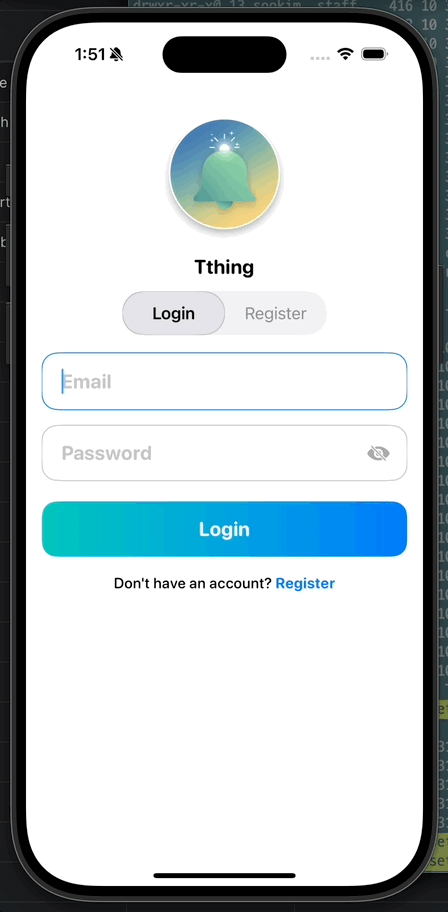
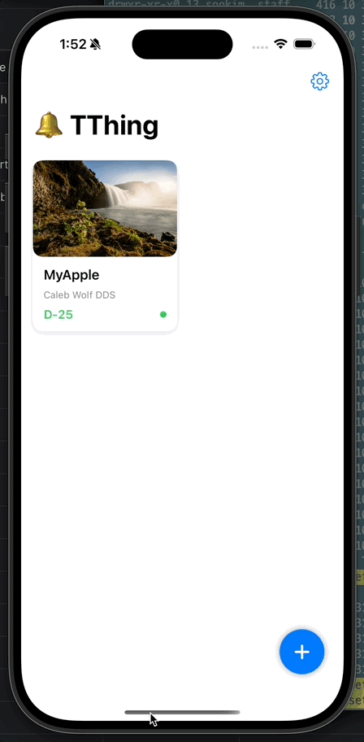

# Tthing - Consumables Replacement Reminder

<div align="center">

**A smart iOS app that helps you track and manage the replacement cycles of everyday consumables**

[](https://www.apple.com/ios/)
[](https://swift.org)
[](https://developer.apple.com/xcode/swiftui/)
[](https://appwrite.io)

</div>

## Overview


Many everyday items like toothbrushes, towels, and razor blades have recommended replacement periods for hygiene and health reasons, but they're easy to forget. **Tthing** solves this problem by helping you track these consumables and notifying you when it's time to replace them.

Simply register a product by selecting its category, and the app automatically suggests appropriate replacement intervals. You'll receive timely push notifications so you never miss a replacement date.

## Preview

> Auth



> Home



## Requirements

- **Xcode 15.0+**
- **iOS 17.0+**
- **Swift 5.9+**
- **Appwrite account** (free tier available)

## Installation

### 1. Clone the Repository

```bash
git clone https://github.com/yourusername/Tthing-iOS.git
cd Tthing-iOS
```

### 2. Open in Xcode

```bash
cd Tthing
open Tthing.xcodeproj
```

### 3. Build and Run

1. Select a simulator or connected device
2. Press `Cmd + R` to build and run

## Configuration

### Dependencies

The project uses Swift Package Manager. Dependencies are automatically resolved:

- **Appwrite SDK** (13.3.1): [appwrite/sdk-for-apple](https://github.com/appwrite/sdk-for-apple.git)

## Acknowledgments

- Built with [SwiftUI](https://developer.apple.com/xcode/swiftui/)
- Backend powered by [Appwrite](https://appwrite.io)

---

<div align="center">

**Made with ❤️ for healthier living**

</div>
